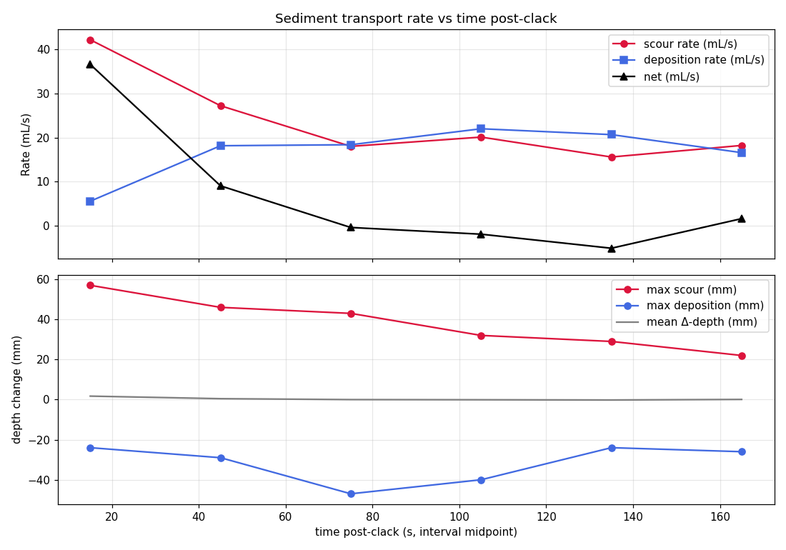
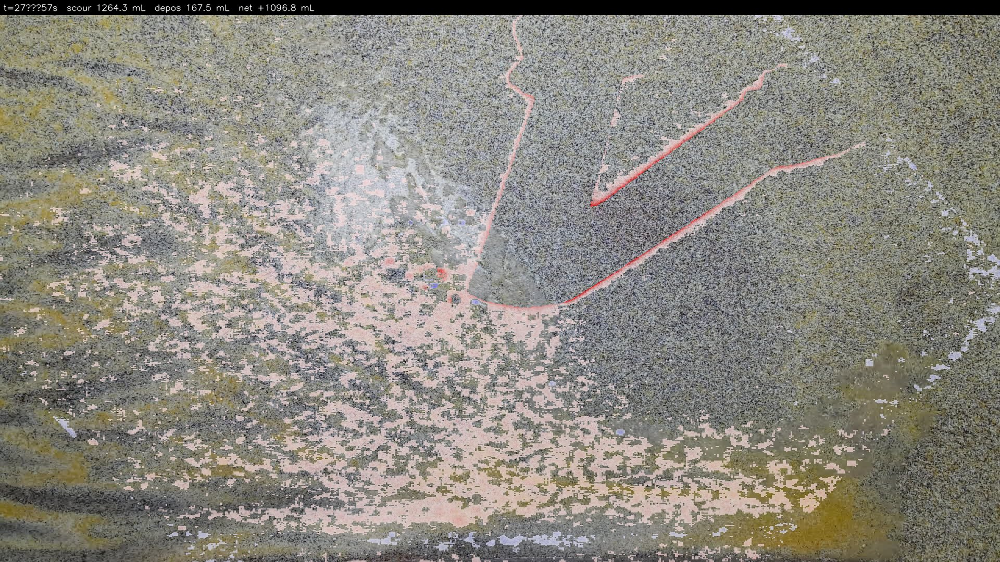
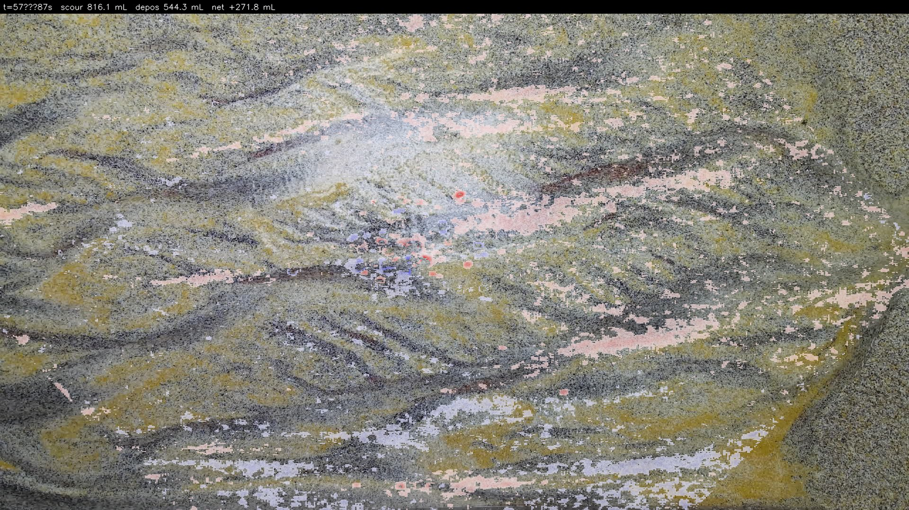
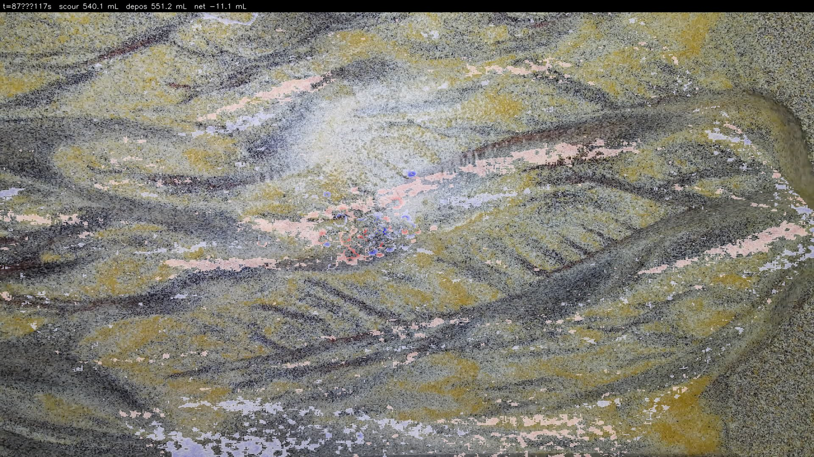
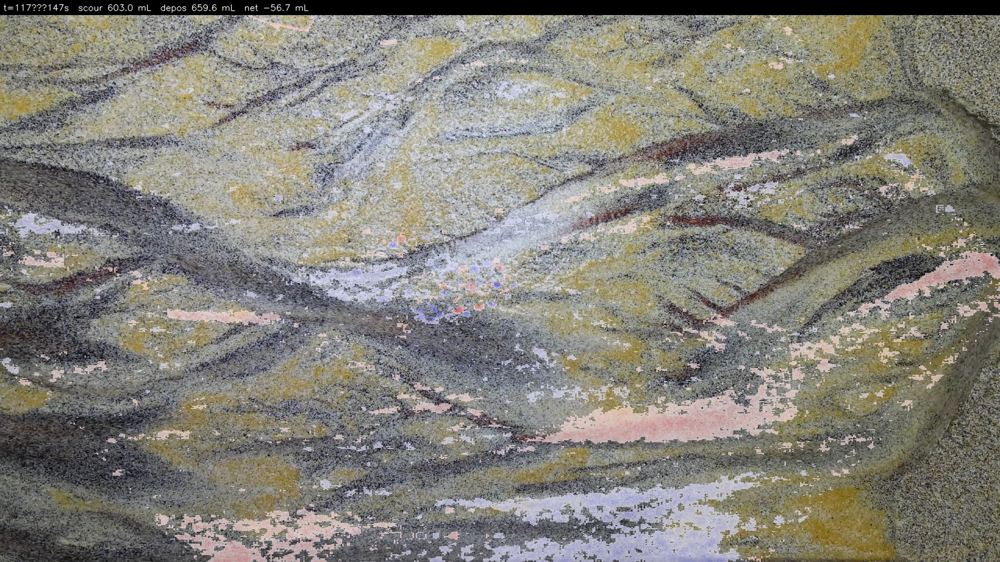
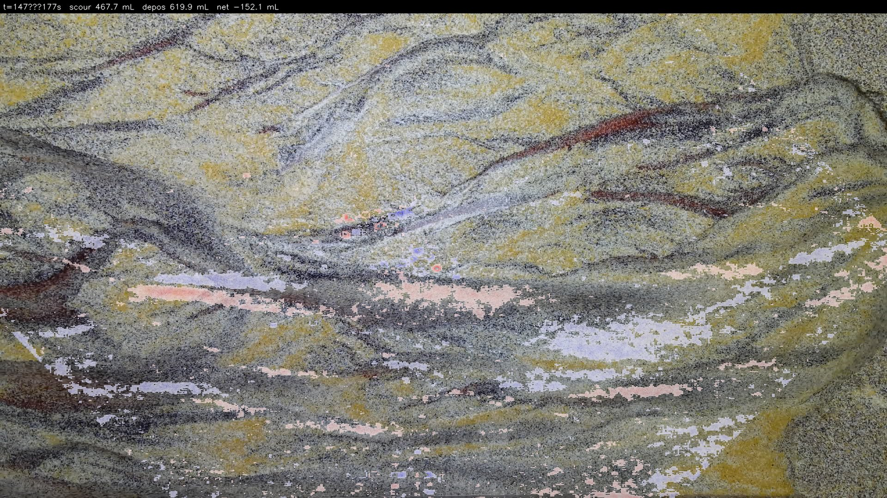
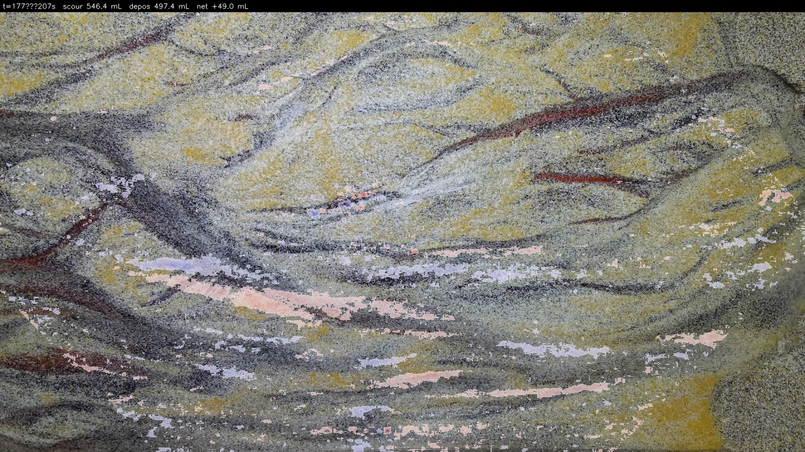

# Bed-change time series — Kinect depth differencing

**Input**: Azure Kinect depth recording of a stream-table experiment (`depth_20260311_105209.mkv`,
237.9 s total, 30 fps depth at 640×576). The source MKV is 20 GB and is not included in the
repository; contact the author for access.

**Method**: For each 30-second interval from the synchronisation clack onward, compare
the Kinect depth frame at the start of the interval to the frame at the end. Positive
Δ-depth = the Kinect sees further away = sediment bed has lowered (**scour**). Negative
Δ-depth = sediment bed has risen (**deposition**). Per-pixel volume change is the depth
change times the pixel's world-frame footprint (which scales with depth).

Pixels outside the sediment-bed depth range (700 – 850 mm) are masked out, filtering the
wooden cross-bar, hands, and any tools that transiently enter the Kinect's field of view.

## Sediment-transport rate over time



Top panel: scour rate (red), deposition rate (blue), and net transport (black) in mL/s
across six 30-second windows.
Bottom panel: max local scour depth (red), max local deposition height (blue), and mean
Δ-depth (grey) per interval.

## Per-interval stats

| t₀ (s) | t₁ (s) | scour (mL) | deposition (mL) | net (mL) | net rate (mL/s) | max scour (mm) | max deposit (mm) |
|---|---|---|---|---|---|---|---|
| 27.4 | 57.4 | **1264** | 167 | **+1097** | +36.6 | +57 | −16 |
| 57.4 | 87.4 | 816 | 544 | +272 | +9.1 | +46 | −19 |
| 87.4 | 117.4 | 540 | 551 | −11 (≈equilibrium) | −0.4 | +43 | −16 |
| 117.4 | 147.4 | 603 | 660 | −57 | −1.9 | +32 | −20 |
| 147.4 | 177.4 | 468 | 620 | −152 | −5.1 | +29 | −18 |
| 177.4 | 207.4 | 546 | 497 | +49 | +1.6 | +22 | −11 |

## Interpretation

1. **First 30 s (27.4 – 57.4 s)**: large initial scour (1.1 L net, 57 mm deepest cut).
   Flow starts and cuts channels aggressively into the unconsolidated sediment bed.
2. **30 – 60 s**: scour rate halves as deposition ramps up; the system finds its
   preferred geometry.
3. **60 – 90 s**: near-balance (−11 mL, effectively noise). Scour and deposition are
   approximately equal.
4. **After 90 s**: small net deposition, with max-scour depth declining monotonically
   (43 → 32 → 29 → 22 mm). The flow has cut its channels; local aggradation now dominates
   over further incision.

The system transitions from **transient scour** to **quasi-equilibrium** at about the
90-second mark post-clack.

## Overlaid on the sediment bed

### 27 → 57 s (strongest scour)



### 57 → 87 s



### 87 → 117 s (equilibrium)



### 117 → 147 s



### 147 → 177 s



### 177 → 207 s



Colour code: **red = scour** (bed dropped), **blue = deposition** (bed rose), **white =
no change**, **grey = masked** (outside sediment-bed depth range).

## Files

- [`summary.png`](summary.png) — rate-vs-time plot
- [`stats.csv`](stats.csv) — raw per-interval numbers
- [`index.html`](index.html) — interactive viewer (requires a local server, e.g. VS Code Live Server)
- `frame_t*.png` — raw Δ-depth maps (depth-camera perspective, 640×576)
- `overlay_t*.jpg` — Δ-depth maps overlaid on the Kinect color frame at t₁

## How it was generated

```bash
python3 scripts/bed_change_timeseries.py --window 30 --step 30
```

Script: [`scripts/bed_change_timeseries.py`](../../scripts/bed_change_timeseries.py)

Depth intrinsics (approximate, scaled from the factory 1024×1024 calibration):

| Parameter | Value |
|---|---|
| fx | 505.0 px |
| fy | 505.2 px |
| cx | 306.3 px |
| cy | 297.2 px |

Pixel area at depth *d* mm: `(d / fx) × (d / fy)` mm².
At the typical bed depth of 772 mm, that's ≈ 2.34 mm² per pixel.
